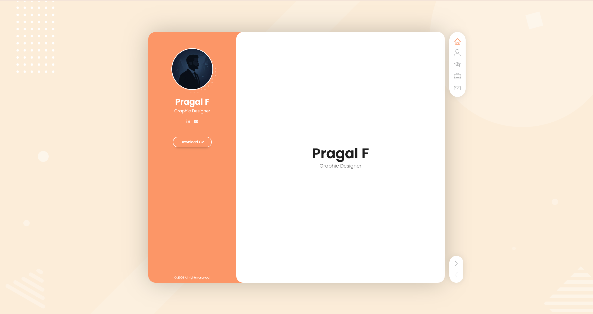
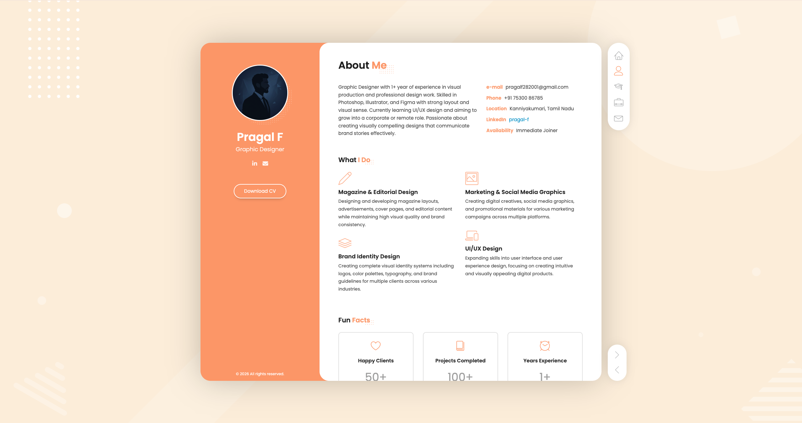
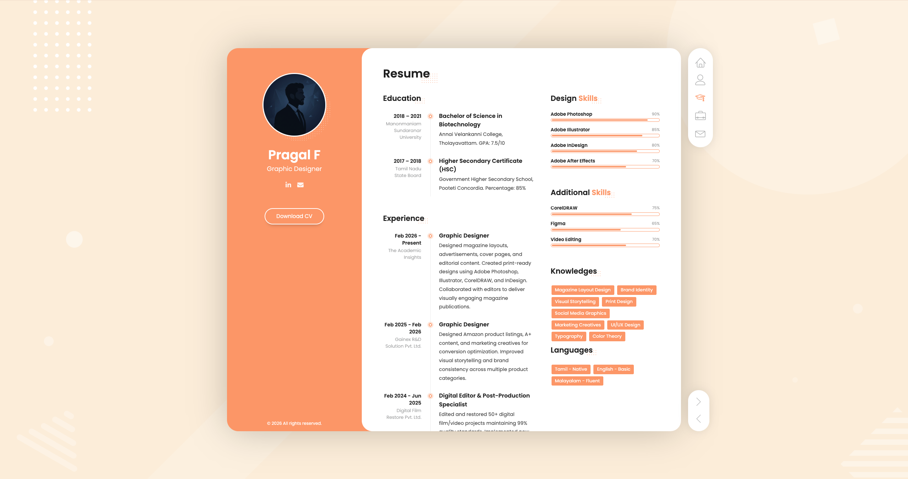
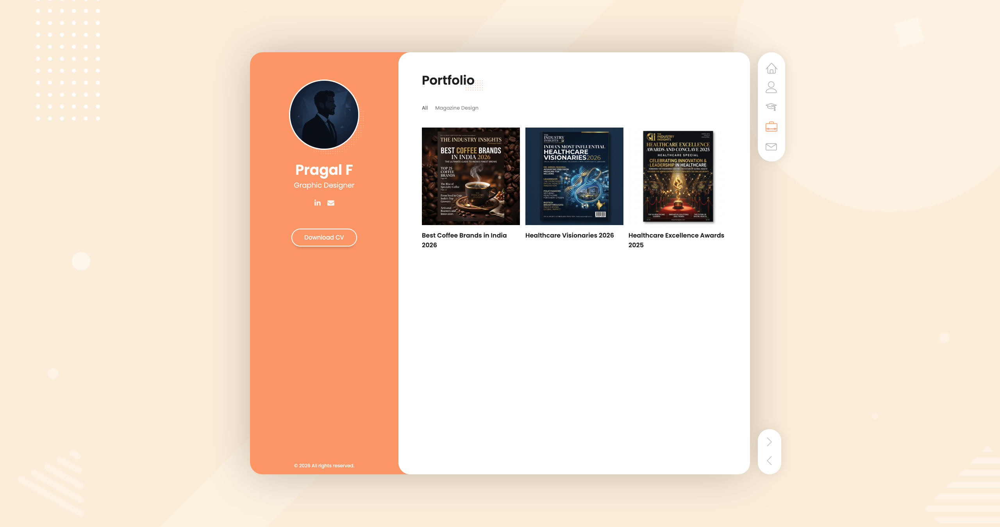
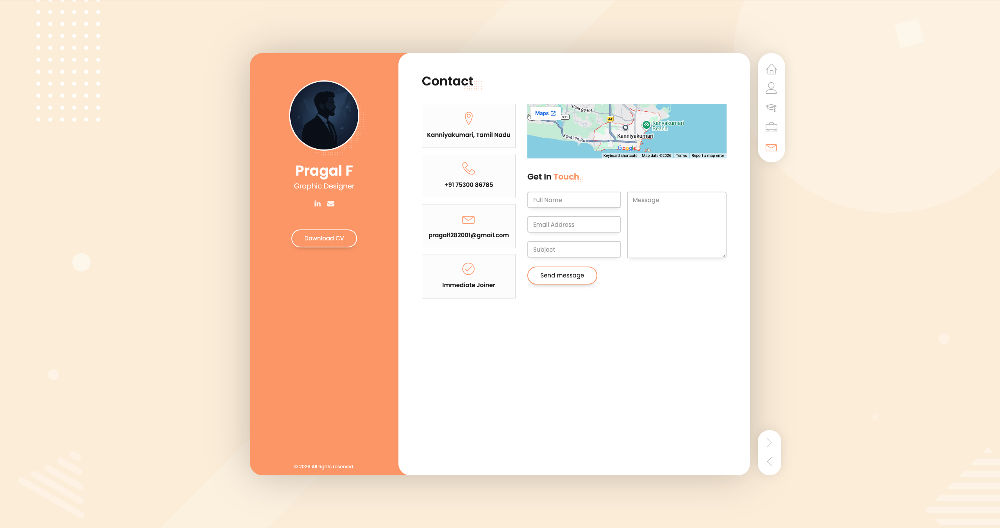

 # 🌊 Pragal Portfolio

<div align="center">



### Graphic Designer

[](https://portfolio-one-sable-58vhtxtk0i.vercel.app/)
### 🚀 Live Website

👉 **https://portfolio-one-sable-58vhtxtk0i.vercel.app/**

</div>

---

## ✨ About The Project

A modern immersive portfolio built using **HTML**, **CSS**, **JS**.

The website combines creative design, smooth animations, and interactive 3D experiences to showcase my skills, projects, and professional journey.

### Key Features

- 🎨 Modern UI/UX Design
- ⚡ Smooth Animations
- 📱 Fully Responsive
- 🚀 Fast Performance
- 🎯 Project Showcase
- 📬 Contact Section

---

# 📸 Screenshots

## Home Section


---

## About Section



---

## Skills Section



---

## Projects Section



---

## Contact Section



---

# 🛠️ Tech Stack

<table>
<tr>
<td>

### Frontend
- JavaScript
- HTML5
- CSS3

</td>
<td>

</td>
<td>

### Tools
- Git
- GitHub
- Vercel

</td>
</tr>
</table>

---

# 🚀 Installation

Clone the repository:

```bash
git clone https://github.com/pragalf282001-creator/portfolio.git